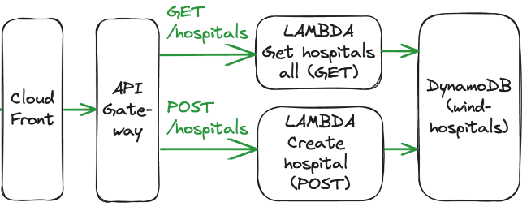

<h1 align="center">
 Reliability Project
</h1>

  This project is a Reliability Project, completed as part of Makers Academy Bootcamp during Week 7 & 8 of the Cloud/DevOps Engineering stream.

## 🎥 Demo Day Video and Presentation

[Video](https://youtu.be/XLbIx-UmkZY?si=G-QV16Xj--54PG45&t=2400) 
[Slides](https://docs.google.com/presentation/d/1amX-0ldebGgqnS9o0RDahwf0Znf59SYq06b_S-MdsrI/edit?usp=sharing)

## 🤝 Our Team
* [Andrew Shakespeare](https://github.com/shakey0)
* [Benedict Valuks](https://github.com/BValuks)
* [Carolina Nogueira](https://github.com/caronog)
* [Denise Chan](https://github.com/denisecodes)
* [Zubayda Hagi](https://github.com/Zhagi)

## 🏡 The scenario

We were tasked to work for a veterinary hospital client's HOSP system where we were asked to:
* Preserve the functionality of the system
* Increase the reliability of the system and ensure no security breaches
* Implement some improvements to the system

## ⛔️ Constraints and Access
* We only had access to the Load Balancer
* We could submit tickets to HOSP or Corporate IT

## 🎯 Our Reliability Target

* The system responds to 99% of user requests successfully
* Ensure no security breaches

## 👀 Getting Visibility 

* Set up an S3 bucket to get logs from the Load Balancer
* Use Athena on AWS to query the logs

## 🔎 Findings

* Saw the we had a fair amount of 5XX status codes
* Varying response times from 2 to 20 seconds

## ⬆️ Improving the Reliability of the System

### 1. Retry Mechanism

Using a retry mechanism would allow for 5XX status codes to be go through the HOSP server up to a certain number of time, rather than just once.

This would increase the success rate of requests and improve the reliability of the system.

### Set up
* Create an Nginx Web Server on an EC2 Instance
* Set up a Reverse Proxy on the Nginx server
    * Allowed failed requests to retry up to 5 times
    * 3 seconds interval between each retry

   

### 2. Caching

Using caching would allow us to store data closer to the user so users can access the data faster. 

This would significantly decrease the amount of requests going directly to the HOSP server as data can be retrieved from the cache instead of the API gateway for some requests, improving the reliability of the system.

### Set Up 
* Create a CloudFront Distribution
* Set up the LoadBalancer as the origin (where traffic is coming from)
* Set up Time to Live (TTL) for 2 mins, allowing data to be stored for up to 2 mins in the cache before expiring and making a new request to the HOSP server

The following diagram shows our infrastructure after setting up a two Nginx Reverse Proxy Servers and a CloudFront.

### 📈 Results

The HOSP's server success rate on the first 4 days 

The HOSP's server consistent success rate of 99.95% and above during the last half of the project 

## 🔒 Mitigating Security Breaches

During the project, we faced security breaches where people with unauthorised access to the HOSP server were able to leave patient notes.

We decided to tighten up the security of our infrastructure and complete one of the improvement tickets - make the service available via HTTPS, given all traffic is HTTP.

### Set Up 
* Add HTTPS decryption at the Load Balancer
* Attach a custom HTTP header at the CloudFront
* Add a rule to the Load Balancer to only accept traffic with the custom header set up on the CloudFront
* Tighten security group rules for Nginx Servers and the Load Balancer
 

## 💨 Migrating the system

At the end of the first week, we received news that the vendor running the upstream system (HOSP) is filing for bankruptcy.

After this event was reported, our team decided to work on migrating the system given we have achieved our reliability goals:
* 99% success rate for user requests
* No security breaches 

While we were brainstorming ideas to migrate the system using a Miro board, we came to a conclusion to do the following:
* Use Lambdas to deal with user requests
* Use a NoSQL database to store the data
* Migrate the Hospitals endpoint first
* Code a scraper to get the data from HOSP

## 📊 Data Scraping

In order to get the data from the hospitals endpoint, we had to code a scraper. 

We found converting the response into a Data Frame using the pandas library an easy method and then saving it to a csv locally afterwards. 

You can find the Jupyter Notebook to scrap the data and the output file: hospitals.csv [here](https://github.com/denisecodes/Reliability-Project/tree/main/scrap_hosp_data)

## 💽 Setting up a NoSQL Database: DynamoDB

We decided to use AWS's NoSQL database system DynamoDB to upload the data we had scraped from the hospitals endpoint. 

### Set Up
* Create an S3 bucket to store hospitals.csv
* Create a DynamoDB database and created a table to link to the S3 bucket

In order to create unique identifier for each hospital when a new hospital is added, we created a hospital counter column which increments by 1 every time a new item is added.

## 🏨 Our New Infrastructure 

In order to use Lambdas, we needed an API Gateway to set up endpoints to run Lambda Functions base on a user's request and connect to our DynamoDB database.

Before migrating the system, we set up a new CloudFront to act as  a development environment to ensure the new system can auto scale and handle any increase in traffic.

### Set up
* Create an API Gateway and connect it to a separate CloudFront, acting as a development environment
* Created the following routes in an API Gateway according to the API documentation for the legacy (HOSP) server to migrate the Hospitals endpoint:
    * Get all hospitals - /hospitals (GET)
    * Get hospital by id - /hospitals/{id} (GET)
    * Create hospital - /hospitals (POST)
    * Update hospital - /hospitals/{id} (PATCH)
    * Delete hospital - /hospitals/{id} (DELETE)

## 🐑 Lambdas

We decided to use Lambdas as they are easy to run code, cheap and auto scales, meaning it can handle any increase in traffic easily.

Also it's serverless architecture which means we don't have to manage a server.

You can find our lambda functions [here](https://github.com/denisecodes/Reliability-Project/tree/main/lambda_functions)

## Speed comparison: Legacy System vs AWS API Gateway

You can see in the speed comparison below that with our new system, the performance dramatically increased. 

Our API Gateway is able requests much more quickly from 4763ms on average before (legacy system) to 53ms (new system)! 

<b>Legacy System</b>

<b>AWS API Gateway</b>

## 🔑 New Authentication Architecture

In the legacy system, every request needed an authorisation header and so we needed to implement this in our new system.

### Set up
* Create a Lambda Function to authenticate users
* Set up a New CloudFront and API Gateway(Frontend) to direct users to the new Lambda Function
* Create a new table in DynamnoDB to store Staff Credentials 
* Connect the Authentication Lambda Function to go to another CloudFront(Backend) in order to be passed through to our API Gateway

## 🔐 Authentication Lambda

This was the most difficult Lambda Function we had to write and we ran into many bugs along the way and had to add new bits to our infrastructure. Although we couldn't finish this in the end as the return response format was not correct, we are confident we would have completed this if we had a few more days. 

### The steps behind the code
1. Checks auth_header and retrieves & decodes staff credentials from DynamoDB.
2. Validates auth_header against known credentials; mismatches yield 'Invalid credentials' error.
3. On successful validation, forwards request to secondary API Gateway via CloudFront.
4. Returns the response from the API Gateway to the client.

You can find the code for the Authentication Lambda [here](https://github.com/denisecodes/Reliability-Project/blob/main/lambda_functions/authentication.py)

### Flow Diagram of the Authentication System

## Our Migration System

Below is a diagram of the infrastructure to complete the full migration of the legacy system to our new system. Eventually once we have all staff credentials stored in DynamoDB we would completely eliminate the old system, deleting the Load Balancer, Nginx Servers and the legacy HOSP server. 

## 👯‍♀️ Agile Methodology

During the Makers course, we were taught how to work in an agile way and we adopted this in our final project. 

### What we did
* Trello board for task management
* Daily communication (stand-ups)
* End of the week reflection (retros)
* Miro board for brainstorming
* Pairing programming

## 🫶 Special Thanks

Shoutouts to the wonderful team at [Makers](https://www.makers.tech/) for teaching us so much in the world of Cloud and DevOps in just 8 weeks. Our coach [Leo](https://github.com/leoht) for guiding us throughout this final project!
